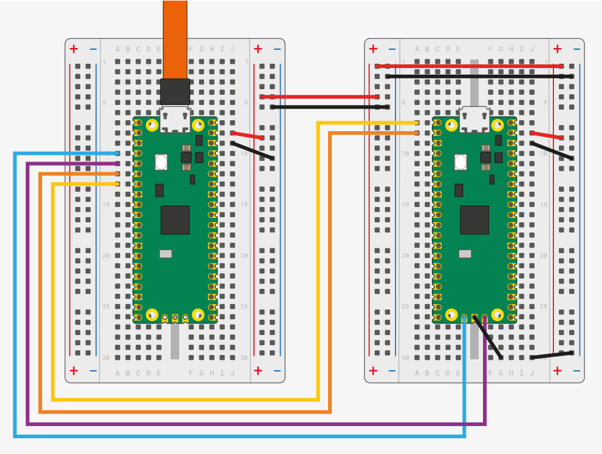

# Pico Debug tool
1. Для использования аппаратной отладки Raspberry Pi Pico необходимо 2 платы, соеденённых по следующей схеме:

**Если используется не оригинальная отладочная плата а китайская, то необходимо свериться с распиновкой**

  - Распиновка RP Pico:
    
  - Распиновка RP Pico W:
    

2. На одну из плат(Слева на схеме подключеня) необходимо загрузить [прошивку отладчика](https://github.com/raspberrypi/picoprobe/releases/latest/download/picoprobe.uf2)

3. Далее стоит убедиться в том, что на вашем компьютере установлен Pico-SDK, если Pico-SDK не установлен, то необходимо [установить](https://github.com/raspberrypi/pico-setup-windows/releases/latest/download/pico-setup-windows-x64-standalone.exe).

4. Если же SDK уже установлен то необходимо открыть экземпляр Visual Studio code добавленный при установке SDK.

5. Далее собрать проект используя Pico-SDK или с помощью PlatformIO, как подружить PIO, RP-Pico и Arduino можно прочитать [тут](https://github.com/stafe-box/PlatformIO-Pico-Guide).

6. Запускаем OpenOCD, **при работе с Windows - во встроенном терминале VS Code для Pico, так как там настроены необходимые переменные окружения**:
```powershell
openocd -f interface/cmsis-dap.cfg -c "adapter speed 5000" -f target/rp2040.cfg -s tcl
```
1. Открываем меню отладки в VS Code и выбираем профиль `Pico Debug with external OCD` и файл с расширением `.elf`, полученный в результате сборки проекта.

2. Готово. Теперь можно дебажить без вывода в Serial